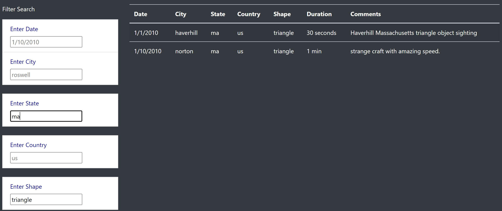

# UFOs

## Overview of the analysis:
The purpose of this project is to build an HTML webpage that shows a list of UFO sightings. The user can filter the data by UFO sighting date, location and UFO shapes. 

## Results:
A user can access the webpage by opening the index.html [index.html](index.html) file using a web browser. The web page looks like the below screenshot.

The following search/filter options are available:

### Filter by Date:

### Filter by City:

### Filter by State:

### Filter by Country:

### Filter by UFO Shape:

### Multiple/Combination of Filters:
You can filter the data using a combination of the above filters. Below is an example where the user has filtered data by shape and state.

## Summary:

- One big drawback is that the data is limited. If we had how many people were at the siting would be a helpful element to validating 
- Two recommendations for improving this website are:
  - adding additional filters like length of the sittings and 
  - provide user the ability to input data on new sitings.
